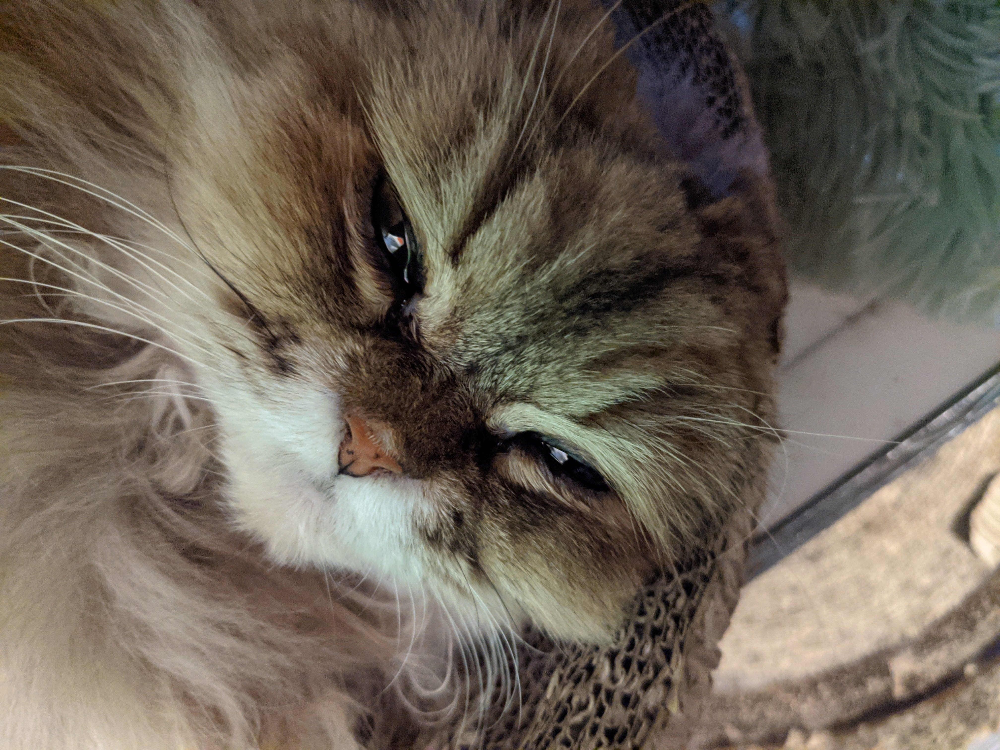

# Po Yu Lai's User Page
## Table of content
[Profile](#profile)\
[Skills](#skills)\
[Link](#link)


## Profile
**Me**\

> My name is Po-Yu Lai, you can also call me Luca. I am an undergraduate third-year transfer student at UCSD, major in Computer Science.

**My cute cat**\


> He likes sleeping and lying in front of the window and staring outside. His favorite food is salmon.

## Skills
### Computer Language
- C
- C++ 
- Java
- Python
- ARM (Assembly)
- Lua

### My top 3 language
1. C++
2. Pyhton
3. Lua

### To-do Project
- [x] Blackjack game
- [x] Logo maker
- [x] File compressor
- [ ] Weather Forecasting APP
- [ ] Library Management System
- [ ] Task Management App


### Link
 [*Here is my github*](https://github.com/Astraeven0502)

<!-- [click on this link](#po-yu-lais-user-page) -->

[Go readme](README.md)

[Go screenshot1](screenshots/Git_Transactions1.png)\
[Go screenshot2](screenshots/Git_Transactions2.png)\
[Go screenshot3](screenshots/Git_Transactions3.png)\
[Go screenshot4](screenshots/Git_Transactions4.png)\
[Go screenshot5](screenshots/VS_Code5.png)

## Code
My first code:
```c++
#include <iostream>
int main() {
    std::cout << "Hello World!";
    return 0;
}
```
Some basic Git commands are:
```
git status
git add
git commit
git push
```